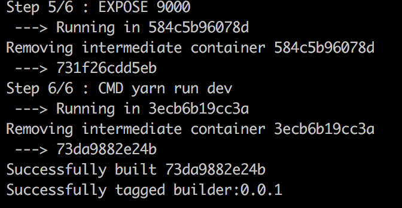
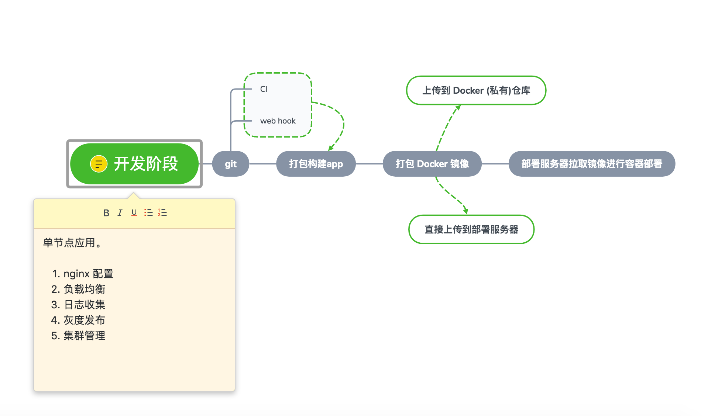

# Docker 入门

## 为什么要使用 Docker

- **环境配置**

  软件开发最大的麻烦事之一，就是环境配置，换一台机器，就要重来一次。由于开发、测试、生产环境不一致，导致有些 bug 并未在开发过程中被发现。而 Docker 的镜像提供了除内核外完整的运行时环境，确保了应用运行环境一致性，从而不会再出现 *「这段代码在我机器上没问题啊」* 这类问题。

- **持续交付和部署**

  使用 Docker 可以通过定制应用镜像来实现持续集成、持续交付、部署。对开发和运维人员来说，最希望的就是一次创建或配置，可以在任意地方正常运行。

- **跟虚拟机比，资源占用少，步骤少，启动快等**

## Docker是什么？

>  Docker is an open platform for developers and sysadmins to build, ship, and run distributed applications. Consisting of Docker Engine, a portable, lightweight runtime and packaging tool, and Docker Hub, a cloud service for sharing applications and automating workflows, Docker enables apps to be quickly assembled from components and eliminates the friction between development, QA, and production environments. As a result, IT can ship faster and run the same app, unchanged, on laptops, data center VMs, and any cloud.

Docker 使用  [Go](https://golang.org/) 进行开发实现，基于 Linux 内核的 [cgroup](https://zh.wikipedia.org/wiki/Cgroups)，[namespace](https://en.wikipedia.org/wiki/Linux_namespaces)，以及[AUFS](https://en.wikipedia.org/wiki/Aufs) 类的 [Union FS](https://en.wikipedia.org/wiki/Union_mount) 等技术。Docker 将应用程序与依赖，打包在一个文件里面。运行这个文件生成一个虚拟容器。程序在这个虚拟容器里运行，就好像在真实的物理机上运行一样。Docker 在容器的基础上，进行了进一步的封装，从文件系统、网络互联到进程隔离等等，极大的简化了容器的创建和维护。

## Docker用途

- **提供一次性的环境**
- **提供弹性的云服务，随开随关**
- **多个容器组建微服务架构**

## 开始Docker

### 一、安装docker

- [Windows](https://docs.docker.com/docker-for-windows/install/)
- [MacOS](https://docs.docker.com/docker-for-mac/install/)
- [CentOS](https://docs.docker.com/install/linux/docker-ce/centos/)

### 二、基本概念

- 1. 镜像（image）

  **Docker 把应用程序及其依赖，打包在镜像文件里面。**只有通过这个文件，才能生成容器（`Container`）。镜像可以看作是容器的模板。Docker 根据镜像文件生成容器的实例。同一个镜像，可以生成多个同时运行的容器实例。

  镜像是通用的，一台机器的镜像文件可以拷贝到另一台机器使用。

- 2. 容器（container）

  **镜像文件生成的容器实例，本身也是一个文件，称为容器文件**，`镜像`和`容器`的关系，就像是面向对象程序设计中的 `类` 和 `实例` 一样，镜像是静态的定义，容器是镜像运行时的实体。容器可以被创建、启动、停止、删除、暂停等。

  容器可以拥有自己的 `root` 文件系统、自己的网络配置、自己的进程空间，甚至自己的用户 ID 空间，进程隔离。

- 3. 仓库（Docker Registry）

  `镜像`构建完成后，可以很容易的在当前宿主机上运行，但是，如果需要在其它服务器上使用这个镜像，我们就需要一个集中的存储、分发镜像的服务，[Docker Registry](https://yeasy.gitbooks.io/docker_practice/repository/registry.html) 就是这样的服务。

### 三、制作镜像

- 编写.dockerignore

  ```dockerignore
  .git
  node_modules
  npm-debug.log
  dist
  ```

- 编写`Dockerfile`文件

  ```dockerfile
  # 指定node官方基础镜像来继承
  FROM node:10.1
  # 将当前目录下的所有文件（除了.dockerignore排除的路径），都拷贝进入 image 文件的/app目录
  COPY . /app
  # 指定接下来的工作路径为/app
  WORKDIR /app
  # 在/app目录下，安装yarn，运行yarn命令安装依赖。注意，安装后所有的依赖，都将打包进入 image 文件。
  RUN npm install yarn -g --registry=https://registry.npm.taobao.org
  RUN yarn
  # 将容器 3000 端口暴露出来， 允许外部连接这个端口。
  EXPOSE 9000
  # 容器启动以后运行命令
  CMD yarn run dev
  ```

- 创建镜像

  ```shell
  docker image build -t builder:0.0.1
  ```


成功截图：




### 四、容器操作

- 根据刚才制作的镜像启动容器

  ```shell
  docker container run -d -p 8001:9000 -it builder:0.0.1
  ```

- 查看容器

  ```shell
  # 查看当前运行容器
  docker container ls
  # 查看日志
  docker logs -f [containerID]
  ```

- 终止容器

  ```shell
  docker container kill [containerID]
  ```

- 删除容器文件

  ```shell
  docker container rm [containerID]
  ```

### 五、docker 单点应用构建部署流程



缺少：

- 1. nginx 配置
- 2. 负载均衡
- 3. 日志收集（docker）
- 4. 灰度发布
- 5. 集群管理（k8s）

### 六、[docker 相关学习](./docker-awesome-list.md)

---


相关命令：


[Docker命令](http://www.runoob.com/docker/docker-command-manual.html)

常用命令：

```shell
# 查看docker版本，验证是否安装成功
docker version
# 查看docker进程
docker ps

# 从仓库拉取镜像，如node,mongo等
docker pull [imageName]:[tag]

# 列出本机所有镜像
docker image ls
# 删除镜像
docker image rm [imageName]
# 从仓库拉取镜像,library是镜像所在的组
docker image pull library/imageName
# 创建镜像，-t表示指定镜像名称
docker image build -t [imageName]
# 导出镜像
docker save [imageName]:[tag] -o [保存文件路径]
# 导入镜像
docker load -i [镜像文件]

# 运行镜像生成容器实例
# -p参数：容器的3000端口映射到本机的8000端口，-p [localPort]:[containerPort]
# -v参数：容器目录映射，-v [localPath]:[containerPath]
# -it参数：容器的 Shell 映射到当前的 Shell，然后你在本机窗口输入的命令，就会传入容器。
# --rm参数：在容器终止运行后自动删除容器文件
# -d参数：后台运行
# -v参数：容器路径和本地路径挂载
# --name参数：指定容器名称，--name=xxx
# --link参数：连接到其他容器，如mongo等，--link=xxx:[别名]
docker container run -d -p 8000:3000 -it [imageName]
# 列出本机正在运行的容器
# --all参数：所有容器，包括终止运行的
# -a参数：处于终止状态的容器
docker container ls
# 终止容器运行，根据容器id或者容器name
docker container kill [containID]
docker container stop [containID]
# 删除容器
docker container rm [containerID]
# 清理所有处于终止状态的容器
docker container prune
# 让已经终止运行的容器实例重新运行
docker container restart [containerID]
# 命令行进入容器
docker exec -it [containerID] bash

# log，查看容器的日志
docker logs -f [containerID]
docker container logs [containerID]
```


`Dockerfile` 常用指令：

- **FROM**

  指定基础镜像，`tag` 默认为 `latest`。如果不以任何镜像为基础，写法为：`FROM scratch`

  格式：

  - `FROM <镜像名称>`
  - `FROM <镜像名称>:<tag>`

- **COPY**

  复制文件

  格式：

  - `COPY <源路径>... <目标路径>`
  - `COPY ["<源路径1>",... "<目标路径>"]`

- **ADD**

  类似COPY的更高级复制文件，不推荐使用

- **WORKDIR**

  使用 `WORKDIR` 指令可以来指定工作目录（或者称为当前目录），以后各层的当前目录就被改为指定的目录，如该目录不存在，`WORKDIR` 会帮你建立目录。

  格式：

  - `WORKDIR <工作目录路径>`

- **RUN**

  运行指定的命令构建一层镜像，换行符是 \

  格式：

  - `shell` 格式：`RUN <命令>`
  - `exec`格式： `RUN ["<可执行文件>", "参数1", "参数2"...]`

- **EXPOSE**

  声明运行时容器提供的服务端口，声明的端口才可以被访问到

  格式：

  - `EXPOSE <端口1> [<端口2>...]`

- **CMD**

  容器启动运行时的命令

  格式：

  - `shell` 格式：`CMD <命令>`
  - `exec` 格式：`CMD ["可执行文件", "参数1", "参数2"...]`
  - 参数列表格式：`CMD ["参数1", "参数2"...]`